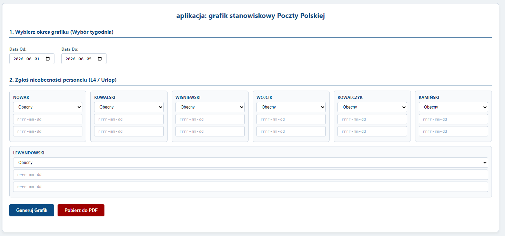
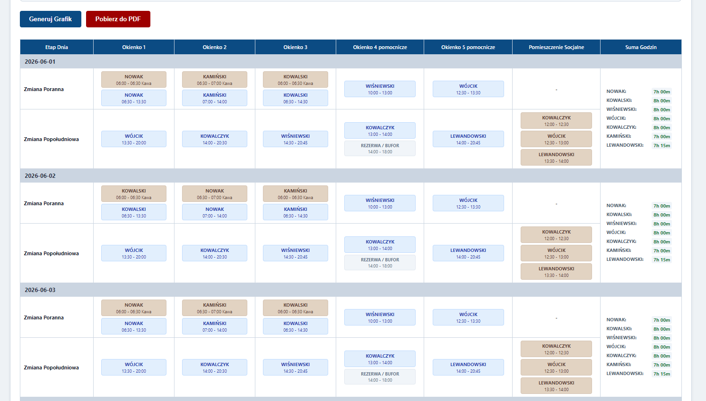

# Poczta – Planowanie okienek

## Opis projektu

Projekt przedstawia koncepcję organizacji pracy okienek w placówce Poczty Polskiej.

Jego celem jest ułatwienie planowania obsady stanowisk oraz czytelna prezentacja harmonogramu pracy w postaci strony HTML.

## Zawartość projektu

- Grafiki HTML prezentujące układ okienek.
- Materiały graficzne.
- Dokumentacja robocza projektu.
- Materiały pomocnicze wykorzystywane podczas tworzenia rozwiązania.

## Technologie

- HTML
- Grafika PNG
- Microsoft Excel
- Microsoft Word

## Status projektu

Projekt ukończony i zachowany jako archiwum demonstracyjne.

---

Autor: Janusz Tracz

## Zrzuty ekranu

### Strona startowa

### Widok grafiku

